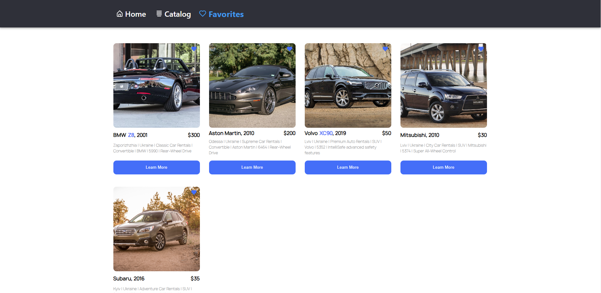

# Drive Ukraine Now

Drive Ukraine Now is a web application that allows users to explore and rent a wide range of vehicles in Ukraine. With our user-friendly platform, you can browse through a variety of car options, find the perfect vehicle to suit your needs, and even save your favorite listings for later. Whether you need a car for a business trip, a family vacation, or just for daily commuting, our service has you covered.

## Features

### Explore and Search

- Browse through a diverse selection of cars, including sedans, SUVs, vans, and more.
- Use search filters to quickly find cars that match your preferences, such as make, model, year, and rental price.

### Save to Favorites

- Create a list of your favorite car listings.
- Easily access and compare your saved options.
- Receive notifications about any updates to your favorite listings.

### Booking and Reservations

- Reserve your chosen car directly from the platform.
- Review rental terms, including pricing, mileage, and availability.

## Getting Started

To get started with our Drive Ukraine Now, follow these steps:

1. Clone this repository to your local machine.
2. Install the necessary dependencies by running `npm install` or `yarn install`.
3. Start the application with `npm start` or `yarn start`.
4. Access the application in your web browser at `http://localhost:3000`.

## Contact Us

If you have any questions, suggestions, or need assistance, feel free to contact our support team at dariaaferreira@gmail.com.

Thank you for choosing Drive Ukraine Now for your car rental needs in Ukraine!

Happy travels!